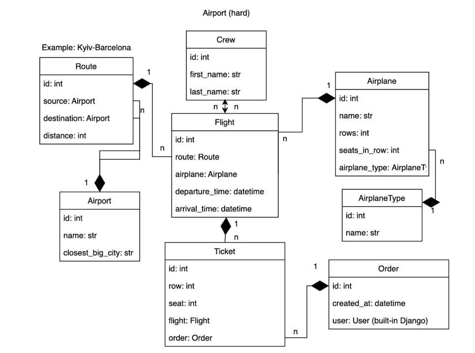

# Airport system
> The airport system that manage air comunication




## Installing / Getting started

1) Installing docker
Install Docker from website
https://www.docker.com/get-started

After installing you can check installed docker version
```shell
docker --version
```

2) Create .env for DB variables
```shell
touch .env
```
After creation, you can write your own variables or use these
```
POSTGRES_USER=airport
POSTGRES_PASSWORD=airport
POSTGRES_DB=airport
POSTGRES_HOST=db_airport_service
POSTGRES_PORT=5432
PGDATA=/var/lib/postgresql/data
```

3) Creation and installation images
In this step need to create app image
```shell
docker compose build
```
and install image of db
(we use _postgres:16.0-alpine3.17_)
```shell
docker pull postgres:16.0-alpine3.17
```

4) Running containers
In this step we run containers from our images
```shell
docker compose up
```

## Developing
To understand how this app works, you can load data to DB
To do this, you need:
1) Exec into the container of app using this command:
`docker exec -it <app_container_name> bash`
2) Inside container load data from .json using this command:
`python manage.py loaddata airport_system_db_data.json`
3) Open in browser page with `http://127.0.0.1:8001/`
4) Get access, refresh token of superuser on page `http://127.0.0.1:8001/api/token/`


## Login
To use functionality you can create own superuser or use this
login: `_admin@admin.admin_`
password: `_adminadmin_`

## Documentation
You can get a documentation on page:
`http://127.0.0.1:8001/api/schema/swagger-ui/` in browser
`http://127.0.0.1:8001/api/schema/` in yaml

## Features
* JWT authenticated
* Admin panel
* Documentation
* Managing orders and tickets
* Creating airports, airplanes, flights, crews
* Filtering flights by airports
* Filtering airplanes by airplane categories
* Adding image to airplane

